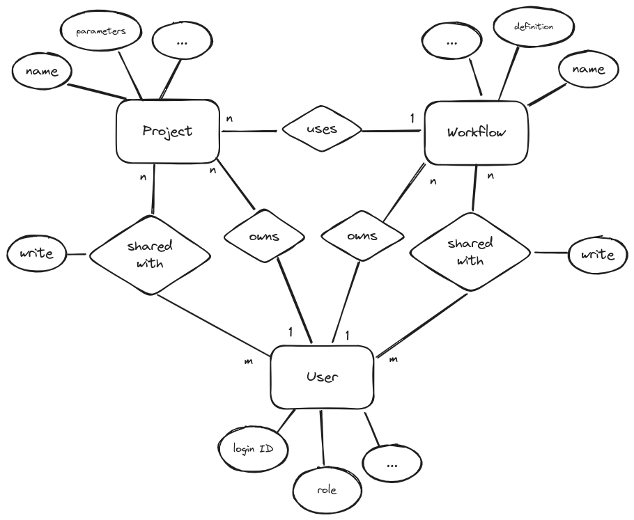

## Architecture

### Entity Component Diagram

### Permissions

For both projects and workflows, permissions act in similar ways. For brevity, "object" here refers to "project or workflow". In order of priority, the following rules apply:

* If the user has the `admin` role, any operation is permitted.
* If the user is set as the owner of the object, any operation is permitted. It is possible for projects to be "orphaned" if the user unregisters from the system. In this case, admin intervention is required.
* If the user has been given shared write access, they are allowed to view the object, as well as modify the object's properties and give out / remove shared privileges for other users. They may not delete the object, change its owner or its public link.
* If the user has been given shared read access, they can view the object, but not modify it.
* (Planned feature) Anyone, including unauthenticated users, can view the object via a guest link that can be enabled and configured by the owner.

## API conventions

### Status codes

* 200 OK - general success
* 201 Created - success on creation
* 401 Unauthorized - user not authenticated
* 403 Forbidden - user authenticated but not permitted to perform operation
* 422 Unprocessable Content - general error