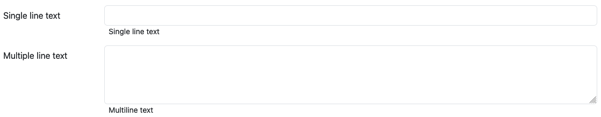

# Workflow integration

How to integrate workflows and what to consider.

## Integration
The workflow integration is done via the `workflow`-menu. A workflow needs a name and description (markdown support) which is presented to the users.

The workflow itself is described by a JSON-document, called workflow definition. This definition tells MAcWorP which workflow engine is used for to execute the workflow, where the workflow is located and several other things.
The following JSON is the definition for the provided Nextflow variant of the input demo workflow:

```json
{
    "engine": "nextflow",
    "src": { 
        "type": "local",
        "directory": "./demo_workflows/nextflow/input_demo",
        "script": "main.nf"
    },
    "engine_parameters": [],
    "parameters": {
        "dynamic": [
            {
                "type": "path",
                "name": "inFile",
                "label": "Input file",
                "desc": "Single file",
                "selectable_files": true,
                "selectable_folders": false
            },
            {
                "type": "path",
                "name": "inFolder",
                "label": "Input folder",
                "desc": "Single folder",
                "selectable_files": false,
                "selectable_folders": true
            },
            {
                "type": "paths",
                "name": "inFiles",
                "label": "Multiple input files",
                "desc": "Multiple files",
                "selectable_files": true,
                "selectable_folders": false
            },
            {
                "type": "paths",
                "name": "inFolders",
                "label": "Multiple input folders",
                "desc": "Multiple folder",
                "selectable_files": false,
                "selectable_folders": true
            },
            {
                "type": "file-glob",
                "name": "txtFiles",
                "label": "Text files",
                "desc": "File \"regex\", e.g. *.txt"
            },
            {
                "type": "number",
                "name": "numberOfNewlines",
                "label": "Number of newlines",
                "desc": "Number input"
            },
            {
                "type": "text",
                "name": "singleLineText",
                "label": "Single line text",
                "desc": "Single line text"
            },
            {
                "type": "text",
                "name": "multilineText",
                "label": "Multiple line text",
                "desc": "Multiline text",
                "is_multiline": true
            },
            {
                "type": "separator",
                "label": "This separator is not a real input, but an element to structure the form"
            },
            {
                "type": "value-select",
                "name": "valueSelect",
                "label": "Selecting on of multiple values",
                "desc": "The value behind Yes is true, the value behind No is false",
                "options": [
                    {
                        "label": "Yes",
                        "value": "true"
                    },
                    {
                        "label": "No",
                        "value": "false"
                    }
                ],
                "value": "true"
            }
        ],
        "static": [
            {
                "type": "path",
                "name": "resultsFolder",
                "label": "",
                "desc": "",
                "selectable_files": true,
                "selectable_folders": false,
                "value": "./results",
                "is_relative": true
            }
        ]
    }
}
```

### Definition elements

* `engine`: Workflow engine to use. Options: `nextflow` & `snakemake`
* `src`: Source defines the location of the workflow, which can be a local directory or a remote repository. In case of Nextflow it is also possible to run workflows from `nf-core`
    * Local example:

            ```json
            "src": { 
                "type": "local",
                "directory": "<path to workflow>",
                "script": "<filename of main script / Snakefile>"
            }
            ```

        Workflow specifics:

        * Nextflow: Added as `<path to workflow>/<filename of main script>` to the `run` command.
        * Snakemake: Added to the Snakemake call as `--snakefile <path to workflow>/<Snakefile>`

    * Remote example:

            ```json
            "src": { 
                "type": "remote",
                "url": "<url to repository>",
                "version": "<commit hash, branch or tag>"
            }
            ```

        Workflow specifics:

        * Nextflow: `nextflow run ... <url to repository> -r <commit hash, branch or tag> ...`
        * Snakemake:
            1. Repository is cloned into a temporary folder in the users project directory.
            2. `snakemake ... --snakefile <temp folder>/<Snakefile> ...`

    * `nf-core` example

            ```json
            "src": { 
                "type": "nf-core",
                "pipeline": "<pipeline>"
            }
            ```

        Workflow specifics:

        * Nextflow: `nextflow run ... nf-core/<pipeline> ...`
    
* `engine_parameters`: Array of parameters name and values for the engine. E.g.

        ```json
        [
            {
                "name": "profile",
                "value": "docker"
            },
            ...
        ]
        ```

    Workflow specifics:

    * Nextflow: `nextflow run ... -profile docker ...`
    * Snakemake: `snakemake ... --profile docker ...`

* `parameters`: Object containing the dynamic and static workflow parameters
    * `dynamic`: Array of parameters selectable by the user in the frontend. This array can contain multiple of:

        * Single path selector:

                ```json
                {
                    "type": "path",
                    "name": "<parameter name>",
                    "label": "<frontend label>",
                    "desc": "<frontend description>",
                    "selectable_files": <true|false>,
                    "selectable_folders": <true|false>
                }
                ```

            `selectable_files` and `selectable_folders` change if files and/or folders can be selected in the dialog.

            **Example**

            Like the multi path selector below with just one element to select.

        * Multi path selector

                ```json
                {
                    "type": "paths",
                    "name": "<parameter name>",
                    "label": "<frontend label>",
                    "desc": "<frontend description>",
                    "selectable_files": <true|false>,
                    "selectable_folders": <true|false>
                }
                ```

            `selectable_files` and `selectable_folders` change if files and/or folders can be selected in the dialog.

            **Example**
            
            

            Multiple path selector, blue button opens dialog

            <br><br>

            

            Dialog to select (`selectable_files` enabled and `selectable_folders` disabled)

        * File glob, which is a file like \"regex\", e.g. *.txt

                ```json
                {
                    "type": "file-glob",
                    "name": "<parameter name>",
                    "label": "<frontend label>",
                    "desc": "<frontend description>"
                }
                ```

            The glob is not resolved by MAcWorP but added to the project path to be used by the workflow.

            **Example**

            

        * Number

                ```json
                {
                    "type": "number",
                    "name": "<parameter name>",
                    "label": "<frontend label>",
                    "desc": "<frontend description>"
                }
                ```

            **Example**

            

        * Plain text

                ```json 
                {
                    "type": "text",
                    "name": "<parameter name>",
                    "label": "<frontend label>",
                    "desc": "<frontend description>"
                    "is_multiline": <true|false>
                }
                ```

            **Example**

            

        * A separator

                ```json
                {
                    "type": "separator",
                    "label": "This separator is not a real input, but an element to structure the form"
                }
                ```

            Just a horizontal line for separation of input into groups.

            **Example**

            
        
        * Select of given value

                ```json
                {
                    "type": "value-select",
                    "name": "<parameter name>",
                    "label": "<frontend label>",
                    "desc": "<frontend description>",
                    "options": [
                        {
                            "label": "<option label 2>",
                            "value": "<value 1>"
                        },
                        {
                            "label": "<option label 2>",
                            "value": "<value 2>"
                        }
                    ],
                    "value": "<optional preselected value>"
                }
                ```

            **Example**

            

            


        
        Note:
        
        * Path and file glob parameters produce absolute paths within the project directory.
        * Each parameter can contain an optional `value` key with a default value.
        * The element's name is used as the workflow parameter for the actual executrion:
            * Nextflow: `nextflow run ... --<parameter name> <selected parameter value> ...`
            * Snakemake: `snakemake ... --config <parameter name>=<selected parameter value> ...`#

    * `static`: Array of the same elements as `dynamic`. Not rendered in the frontend nor changeable by the user.
        * `path`-element can contain the optional `is_relative`-key (`<true|false>`) which makes the path relative to the project/work directory


## File rendering
MAcWorP is able to render a couple of file formats directly in the browser. The file extension tells the renderer how the element should be rendered.   
Below is a list of supported elements:

| Type | File extension | Description |
| --- | --- | --- |
| Raster graphics | `.png`, `.jpg`, `.jpeg`, `.gif`, `.webp`, `.bmp` | Images are display using [Viewer.js](https://fengyuanchen.github.io/viewerjs/). This gives the user some useful features, like zooming |
| Vector graphics | `.svg`, `.image.svg` | SVG files can be rendered iun two ways, embedded into the DOM (`.svg`) which automatically scales it, or within an img-Tag (`.image.svg`) |
| PDF | `.pdf` | PDFs are shown using the browser integrated PDF viewer |
| Table | `.csv`, `.tsv`, `.xlsx` | Tables are rendered using the HTML-table elements. As two many cells will make browser unresponsive, tables with to many elements will be paginated |
| Interactive plots | `.plolty.json` | To generate Plolty conform JSON files, have a look into the [documentation](https://plotly.com/python-api-reference/generated/plotly.io.to_json.html#plotly.io.to_json). These kind of plots have few advantages for the user, like the ability to enable/disable traces and zoom. MAcWorP is also adding a JSON editor to change the plot layout or colors. |
| Plain text | `.txt` | Show the content of the text file |


### Metadata files
Each result file can be annotated with a header and description, by adding a JSON formatted MAcWorP metadata file next to the result file. It should have the same name as the result file plus the extension `.mmdata`, e.g.:
* File to annotate file: `./some_barplot.png`
* Metadata file:  `./some_barplot.png.mmdata`

The content would look like this:

```json
{
    "header": "That some kind of a bar plot",
    "description": "Some very lengthy description, telling users what the barplot is showing."
}
```
Header and description are then rendered in the frontend. If no metadata is given, the header is replaced by the filename and the description skipped.

Have a look into the [results demo workflow](./demo_workflows/result_demo/)

## Recommendation
1. In general it is a good idea to use publicly available Docker container to manage your dependencies as most workflow engines can download containers by themselves. For help see:
    * [Nextflow](https://snakemake.readthedocs.io/en/stable/snakefiles/deployment.html#running-jobs-in-containers)
    * [Snakemake](https://snakemake.readthedocs.io/en/stable/snakefiles/deployment.html#running-jobs-in-containers)
    However it is possible use dependencies installed via Conda or package managers, but it has to be done manually on each worker. 